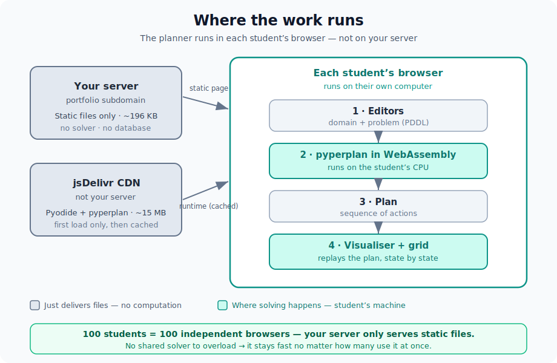

# PDDL Playground

An interactive, in-browser tool for teaching and exploring **AI planning** with
PDDL. Write a planning **domain** and **problem**, choose a **solver**, watch the
plan execute step by step (with a 2-D grid animation for the *MineField* domain),
and compare solvers side by side — all running entirely in the visitor's browser.

> **Deployment:** see **[Deployment](#deployment)**. In short, this is a plain
> **static site** — `npm run build` and serve the `dist/` folder. No backend,
> no database, no secrets.

---

## Deployment

This is a **static single-page app**. There is no server-side code: the planner
(`pyperplan`) runs in each visitor's browser via WebAssembly. To publish it you
only need to build it and serve the resulting static files.

### 1. Build

Requires **Node.js ≥ 20** (developed on Node 24).

```bash
npm ci          # or: npm install
npm run build   # outputs the static site to ./dist
```

`dist/` is the complete, self-contained website (HTML + JS + CSS, ~200 KB
gzipped). Asset paths are **relative** (`base: './'` in `vite.config.ts`), so it
works whether served from a subdomain root or a sub-path.

### 2. Serve the `dist/` folder

Point a subdomain (e.g. `pddl.example.com`) at the contents of `dist/`. Any
static file server works. **Caddy** example (`Caddyfile`):

```caddy
pddl.example.com {
    root * /var/www/pddl-playground/dist
    encode gzip zstd
    file_server
    # Optional SPA fallback (the app is single-page; harmless to include):
    try_files {path} /index.html
}
```

Caddy provisions HTTPS automatically. With another server (nginx/Apache/static
host), just serve `dist/` as the document root.

### Requirements and runtime notes

- **Serve over HTTPS.** The app uses a secure-context API (clipboard for "share
  link"); Caddy gives automatic HTTPS out of the box.
- **Outbound internet at runtime.** On first load the visitor's browser
  downloads the Python/WASM runtime and the planner from public CDNs:
  - `https://cdn.jsdelivr.net` — Pyodide runtime (version-pinned)
  - `https://files.pythonhosted.org` (PyPI) — the `pyperplan` wheel
  These are fetched **by the browser, not the server**, and cached afterward.
  If you add a **Content-Security-Policy**, it must allow those two hosts plus
  `'wasm-unsafe-eval'` (Pyodide compiles WebAssembly). Example directive:
  ```
  Content-Security-Policy: default-src 'self';
    script-src 'self' 'wasm-unsafe-eval' https://cdn.jsdelivr.net;
    connect-src 'self' https://cdn.jsdelivr.net https://files.pythonhosted.org;
    style-src 'self' 'unsafe-inline'; img-src 'self' data:;
  ```
  If you don't set a CSP at all (typical), **nothing to configure** — it just works.
- **No special headers needed.** Standard Pyodide does not require cross-origin
  isolation (no COOP/COEP).
- **Caching.** Built assets are content-hashed, so you can cache `assets/*`
  aggressively; serve `index.html` with a short/no cache so updates roll out.

### Verifying the production build before going live

```bash
npm run preview   # serves the built dist/ locally; open the printed URL, click Solve
```

### Optional: enable server-side solving

By default the site is fully offline: the in-browser engine works without any
backend, and the server/epistemic engines show an explanatory note. Deploying the
separate [`pddl-epistemic-backend`](../pddl-epistemic-backend) service and
building with its URL enables two additional engines:

```bash
VITE_EPISTEMIC_API=https://epistemic.example.com npm run build
```

- **Server (full PDDL)** — sends the domain and problem to the backend's BFWS
  planner, which handles negative preconditions, conditional effects and action
  costs natively (no compilation step).
- **Epistemic (E-PDDL)** — solves multi-agent epistemic problems on the backend.

With the variable unset, both engines are disabled and the build stays 100%
static/offline.

---

## Features

- **Two live PDDL editors** (domain + problem) with syntax highlighting and
  inline validation (unbalanced parentheses, missing headers).
- **Three solver engines** — a top-level picker selects where planning runs:
  *in-browser* (`pyperplan`, fully offline), *server* (full-PDDL BFWS on the
  optional backend), and *epistemic* (E-PDDL on the backend). The server and
  epistemic engines are enabled only when a backend URL is configured at build
  time (see [Deployment](#optional-enable-server-side-solving)).
- **Multiple in-browser solvers** — `pyperplan` search/heuristic combinations as
  presets: BFS (uninformed), A\* + hFF, A\* + hMax / LM-Cut (admissible →
  optimal), Greedy Best-First, Weighted A\*.
- **"Compare all"** — runs every solver on the same problem and tabulates plan
  length, nodes expanded and time, so students see the search/heuristic
  trade-off (e.g. uninformed BFS expands far more nodes than A\* + hFF).
- **Step-through visualiser** — play/pause/scrub the plan; per-step
  `+ added` / `− deleted` state diff; goal tracking; static facts hidden by
  default for readability.
- **Domain-specific MineField grid** — animates the robot collecting gold and
  avoiding obstacles on a 2-D grid.
- **Negative-precondition compiler** — domains using `:negative-preconditions`
  (which `pyperplan` can't solve) are compiled to a positive equivalent on the
  fly, so the original dissertation domain runs verbatim.
- **Sharing & persistence** — copy a self-contained share link (domain + problem
  compressed into the URL), download `.pddl`/plan files, and auto-save the last
  session to `localStorage`.
- **Epistemic (E-PDDL) explorer** — write/explore epistemic-planning domains
  (reasoning about what agents *know*). Not solved in-browser; instead the app
  explains how they're solved by *compiling to classical planning*
  (RP-MEP / `pdkb-planning`).
- **Built-in examples** — MineField (positive + original/negative encodings),
  Gripper, Blocksworld, Towers of Hanoi, and a Coin-in-the-Box epistemic example.
- **Light / dark theme**, onboarding card, and a first-load progress indicator.

## Architecture



The server only serves static files. The solver runs in each visitor's browser,
so there is no shared back-end to overload — it scales to any number of
concurrent users.

## Local development

```bash
npm install
npm run dev      # http://localhost:5173 (hot reload)
```

## Tests

```bash
npm test         # Vitest: parser, plan simulator, compilers, validators
```

## Project structure

```
src/
  App.tsx                     UI shell + state wiring
  components/                 CodeEditor, PlanVisualiser, MinefieldGrid,
                              ComparisonTable, EpistemicPanel, EngineLoader, Intro
  solver/
    pyperplanRunner.ts        loads Pyodide + pyperplan, runs the planner
    presets.ts                solver (search + heuristic) presets
  pddl/
    parser.ts                 lightweight PDDL parser (S-expressions)
    simulate.ts               applies a plan → per-step state + diff
    compileNegatives.ts       :negative-preconditions → positive normal form
    minefield.ts              grid interpretation for the MineField view
    validate.ts               inline editor validation
    pddl.test.ts              unit tests
  data/examples.ts            built-in domains/problems
  share.ts                    share-link encode/decode, downloads, autosave
docs/architecture.svg         "where the work runs" diagram
```

## Design note: PDDL subset

`pyperplan` supports **STRIPS + typing** with **positive preconditions only**.
When "Compile negative preconditions" is on (the default), a domain that negates
a predicate `P` in a precondition is compiled to **positive normal form** before
solving — a complementary predicate `not-P` is introduced, the initial state is
completed under the closed-world assumption, and effects are mirrored. The
original sources stay in the editors and drive the visualiser; only the solver
sees the compiled version. See [`src/pddl/compileNegatives.ts`](src/pddl/compileNegatives.ts).
Delete effects (e.g. `(not (at ?r ?from))`) are pure STRIPS and never need rewriting.

## Scope & future work

The default in-browser engine runs **fully in the browser**, so the tool stays
reliable and offline. It covers the **STRIPS + typing** subset (plus negative
preconditions via the compiler). The optional backend extends this:

- **Full-PDDL features** (negative preconditions, conditional effects, action
  costs) are handled by the **server engine**, which solves on the backend's
  BFWS planner. This avoids the in-browser compiler and supports domains
  `pyperplan` cannot parse.
- **Epistemic (E-PDDL) solving** is performed by the **epistemic engine**, which
  *compiles to classical planning*
  ([pdkb-planning](https://github.com/QuMuLab/pdkb-planning),
  [E-PDDL](https://github.com/FrancescoFabiano/E-PDDL)) on the backend. The in-app
  explorer documents this pipeline.
- **Further work** — optimal planning with a heavier planner such as
  [Fast Downward](https://www.fast-downward.org/) and temporal planning are not
  yet wired up; both would extend the same backend.

## Tech stack

React + TypeScript + Vite · CodeMirror 6 (editors) · Pyodide + `pyperplan` (solver,
loaded at runtime, not bundled) · lz-string (share links) · Vitest (tests).

## Credits

`pyperplan` (the planner) is GPL-licensed and is loaded **at runtime** in the
browser from PyPI — it is not bundled into this site's source. Built as an MSc
portfolio project alongside a dissertation on SMT/BMC for AI planning.

Developed with assistance from Claude Code, used to refine the design and the
wording of the documentation and UI.
